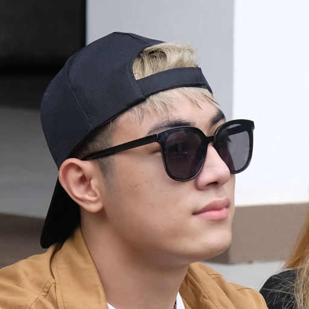
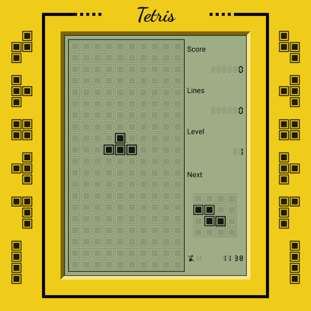
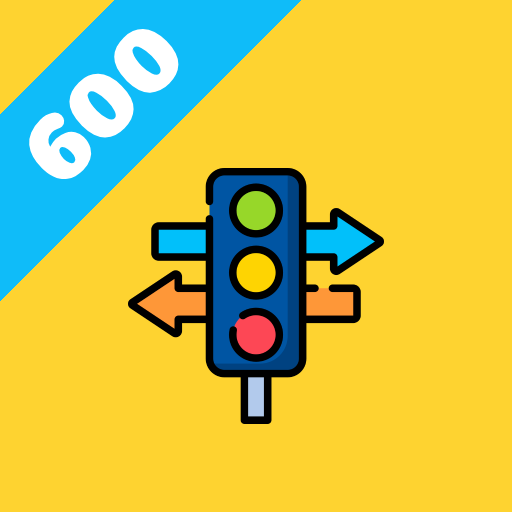

###

###

###

<a href="https://play.google.com/store/apps/details?id=khoa.omega.tetris" style="text-decoration: none"><b>Tetris: Classic Puzzle Game</b></a>

###

<a href="https://play.google.com/store/apps/details?id=khoa.omega.gplxv2" style="text-decoration: none"><b>Thi Sát Hạch GPLX - 600 Câu</b></a>

###

<picture>
  <source
    srcset="https://raw.githubusercontent.com/khoa-omega/khoa-omega/output/snake-dark.svg"
    media="(prefers-color-scheme: dark)">
  <source
    srcset="https://raw.githubusercontent.com/khoa-omega/khoa-omega/output/snake-light.svg"
    media="(prefers-color-scheme: light), (prefers-color-scheme: no-preference)">
  
</picture>

###

<picture>
  <source
    srcset="https://github-readme-stats.vercel.app/api?username=khoa-omega&show_icons=true&hide_border=true&theme=github_dark"
    media="(prefers-color-scheme: dark)">
  <source
    srcset="https://github-readme-stats.vercel.app/api?username=khoa-omega&show_icons=true&hide_border=true"
    media="(prefers-color-scheme: light), (prefers-color-scheme: no-preference)">
  
</picture>

###

###
